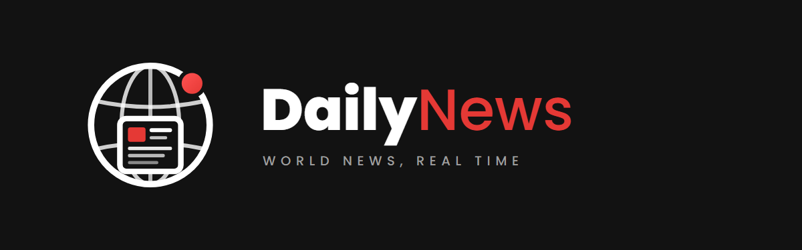
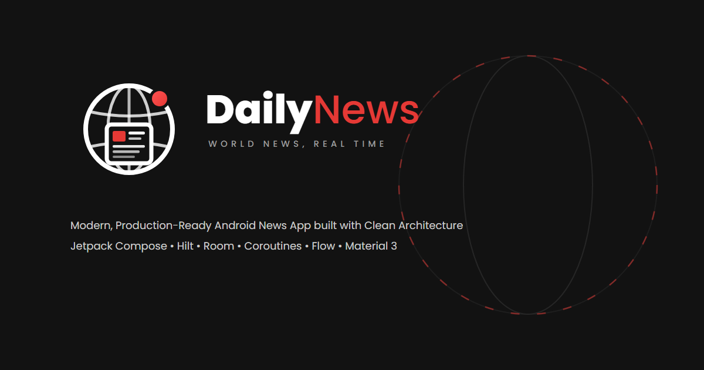

# DailyNews — Global Real-Time News

  

**A modern, production-grade Android application delivering breaking world news in real-time.**  
Built with **Jetpack Compose**, **Clean Architecture**, **MVVM**, **Hilt**, **Room**, **Coroutines & Flow**, and **Material Design 3**.

---

## 🚀 Features

- **Real-Time News Feed**: Browse top headlines across global news sources.
- **Categorized News**: General, Business, Technology, Sports, Science, Health, and Entertainment.
- **Full-Text Article Detail**: Detailed article view with author attribution and web browser link out.
- **Instant Search**: Search through live news articles with debounced queries.
- **Offline Cache**: Local caching powered by Room Database for offline reading.
- **Theme & Localization**: Dark and Light themes with dynamic English & Arabic (RTL) localization support.

---

## 🏗️ Architecture & Tech Stack

The app follows **Clean Architecture** principles separated into domain, data, and presentation layers:

- **UI Framework**: [Jetpack Compose](https://developer.android.com/jetpack/compose) with Material Design 3
- **Dependency Injection**: [Hilt](https://dagger.dev/hilt/)
- **Local Persistence**: [Room Database](https://developer.android.com/training/data-storage/room) & [Preferences DataStore](https://developer.android.com/topic/libraries/architecture/datastore)
- **Networking**: [Retrofit 3](https://square.github.io/retrofit/) & [OkHttp 4](https://square.github.io/okhttp/)
- **Image Loading**: [Glide Compose](https://github.com/bumptech/glide)
- **Async & Reactive**: Kotlin Coroutines & `Flow`

---

## 🎨 Brand Identity

The complete visual identity system is maintained in the [Brand](Brand/) directory:

- **Primary Accent**: `#E53935` (Crimson Red)
- **Canvas Background**: `#121212` (Midnight Dark)
- **Surface Elevation**: `#1E1E1E` (Dark Card Surface)
- **Typography**: Poppins
- **Guidelines**: [Brand_Guidelines.md](Brand/Guidelines/Brand_Guidelines.md)
