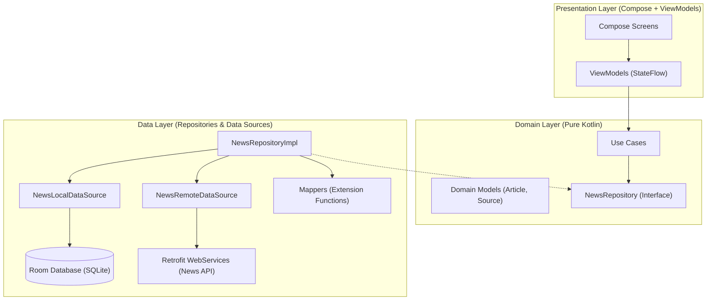

<div align="center">

# 📰 DailyNews

### Production-Grade Offline-First Android News Application

DailyNews is a modern Android application built with Jetpack Compose and Clean Architecture that delivers real-time headlines and articles powered by the News API. Features full offline support, transactional Room caching, reactive state management using StateFlow, and per-app language settings.

[](https://developer.android.com)
[](https://kotlinlang.org)
[]()
[](https://developer.android.com/jetpack/compose)
[](.github/workflows/android-ci.yml)
[](LICENSE)

</div>

---

## 📱 Screenshots

<p align="center"> 
  
  
  
</p>

---

## ✨ Features

- 📰 **News Categories** — Browse news across Business, Entertainment, General, Health, Science, Sports, and Technology.
- 📡 **Source Filtering** — Dynamically load and switch news sources per category.
- 🔍 **Search** — Search articles online with automatic local index caching and offline search fallback.
- 💾 **Offline-First Architecture** — Seamless offline availability powered by Room database and local fallback strategies.
- 🔄 **Transactional Cache Policy** — Replace-on-Success cache strategy using `@Transaction` Room DAO operations.
- 🎨 **Jetpack Compose Material 3** — Modern declarative UI with dark mode support.
- ⚡ **Reactive StateFlow** — Unidirectional Data Flow (UDF) using `StateFlow` and lifecycle-aware Compose collection.
- 🌐 **Per-App Language Settings** — Multi-language support (English & Arabic) integrated with AndroidX AppLocales.
- 🛡 **Strict Model Separation** — Pure decoupling between Network DTOs, Database Entities, and Domain Models.
- 🔐 **Secure Key Management** — Safe `NEWS_API_KEY` resolution via `local.properties` and CI environment variables.

---

## 🏛 Architecture

DailyNews follows Google's recommended **Clean Architecture** with the **MVVM** pattern, enforcing unidirectional data flow and complete layer independence.



### Layer Responsibilities

- **Presentation Layer** — Jetpack Compose screens, Material 3 components, `NewsViewModel` & `SearchViewModel` emitting sealed UI state flows (`SourcesUiState`, `ArticlesUiState`, `SearchUiState`).
- **Domain Layer** — Pure Kotlin business objects (`Article`, `Source`), Use Case interactors (`GetSourcesUseCase`, `GetArticlesUseCase`, `SearchArticlesUseCase`), and repository interface contracts.
- **Data Layer** — `NewsRepositoryImpl`, network DTOs (`SourceDto`, `ArticleDto`), database entities (`SourceEntity`, `ArticleEntity`), Room DAOs (`SourcesDao`, `ArticlesDao`), and extension mappers (`DTO -> Entity -> Domain`).
- **Utils Layer** — Cross-cutting concerns including `DataError` / `DataException` error mapping and `Connectivity` network monitoring.

---

## 🛠 Tech Stack

| Category | Library / Tool | Purpose |
|---|---|---|
| **Language** | Kotlin 2.2.10 | Core programming language |
| **UI** | Jetpack Compose + Material 3 | Declarative UI framework |
| **Architecture** | Clean Architecture + MVVM | Layer separation and maintainability |
| **Dependency Injection** | Hilt 2.57.1 | Component dependency injection |
| **Database** | Room 2.8.4 | Offline database persistence |
| **Networking** | Retrofit 3.0 + OkHttp 4.12 | REST API communication |
| **Preferences** | Jetpack DataStore | User setting preferences |
| **Image Loading** | Glide Compose 1.0.0-beta08 | Asynchronous image loading |
| **Async & Streams** | Kotlin Coroutines & Flow | Reactive asynchronous programming |
| **Navigation** | Navigation Compose | Type-safe screen routing (`kotlinx.serialization`) |
| **Logging** | Timber 5.0.1 | Debug & release log management |
| **Build System** | Gradle 9.3.1 + KSP 2.3.2 | Build automation and annotation processing |

---

## 📂 Project Structure

```text
app/src/main/java/com/mohamed/dailynews/
├── data/
│   ├── api/                  # Retrofit API service & DTOs (SourceDto, ArticleDto)
│   ├── database/             # Room Database, Entities (SourceEntity, ArticleEntity), DAOs
│   ├── mapper/               # Pure extension mappers (toEntity, toDomain)
│   ├── repositories/         # NewsRepositoryImpl & Local/Remote Data Source implementations
│   └── di/                   # Hilt DI Modules (AppModule, NetworkModule, DataBaseModule, PreferencesModule)
├── domain/
│   ├── model/                # Domain entities (Source, Article)
│   ├── repository/           # Repository contract interfaces
│   └── usecase/              # Business Use Cases (GetSources, GetArticles, SearchArticles)
├── ui/
│   ├── screens/              # Jetpack Compose screens (Home, Search, Settings) & ViewModels
│   ├── theme/                # Material 3 Theme, Typography, Color definitions
│   └── model/                # UI Enums (Category)
└── utils/
    ├── error/                # DataError sealed interface & DataException
    └── Connectivity.kt        # Network connectivity observer
```

---

## ⚙️ Getting Started

### Prerequisites

- Android Studio Ladybug / Narwhal or newer
- JDK 17
- Android SDK (minSdk 26, targetSdk 36)

### Installation

1. **Clone the repository**:
   ```bash
   git clone https://github.com/MohamedMosad0/DailyNews.git
   cd DailyNews
   ```

2. **Configure API Key**:
   Obtain a free API key from [News API](https://newsapi.org/) and add it to your `local.properties` file:
   ```properties
   NEWS_API_KEY=your_actual_api_key_here
   ```

3. **Build Debug APK**:
   ```bash
   ./gradlew assembleDebug
   ```

---

## 🧪 Testing

The project includes JVM unit tests built using in-memory test fakes:

- **Repository Tests** — Verifies online success, online failure cache fallback, offline `NoCache` error handling, and search result insertion.
- **ViewModel Tests** — Verifies StateFlow emissions (`Loading`, `Success`, `Error`, `Empty`), debounce timing, and job cancellation on consecutive requests.
- **Mapper Tests** — Verifies null/blank primary key filtering and DTO → Entity → Domain transformations.
- **UseCase Tests** — Verifies business Use Case execution.

Run the test suite:

```bash
./gradlew testDebugUnitTest
```

---

## 🚀 CI/CD & Build Validation

Continuous Integration is automated using **GitHub Actions** (`.github/workflows/android-ci.yml`):

- JDK 17 environment
- Single-pass Gradle build execution (`assembleDebug testDebugUnitTest lintDebug assembleRelease`)
- R8 code and resource shrinking on release builds
- Automated Debug and Release APK artifact packaging

Run full local verification:

```bash
./gradlew assembleDebug assembleRelease testDebugUnitTest lintDebug
```

---

## 📄 License

This project is licensed under the MIT License. See the [LICENSE](LICENSE) file for details.
