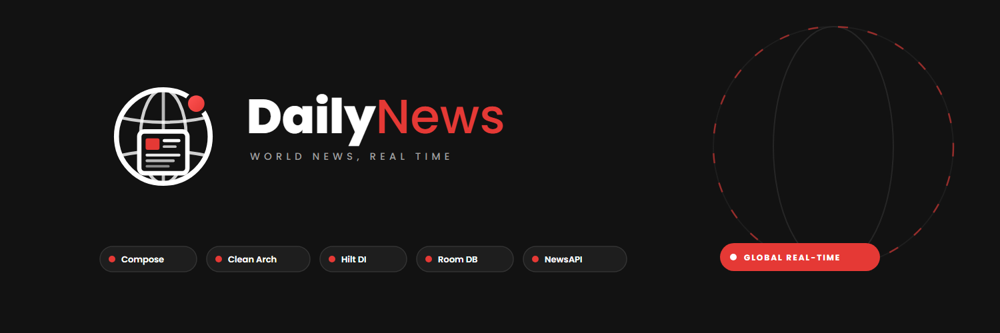
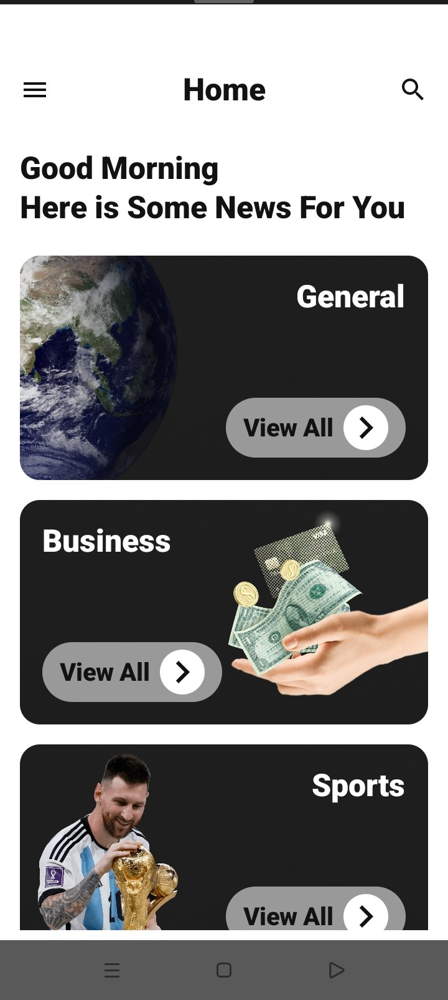
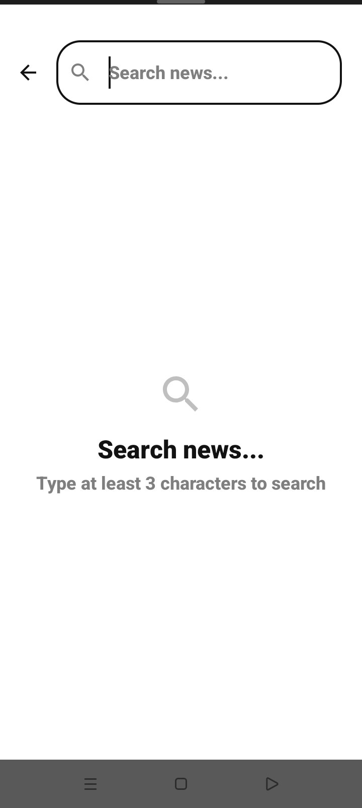
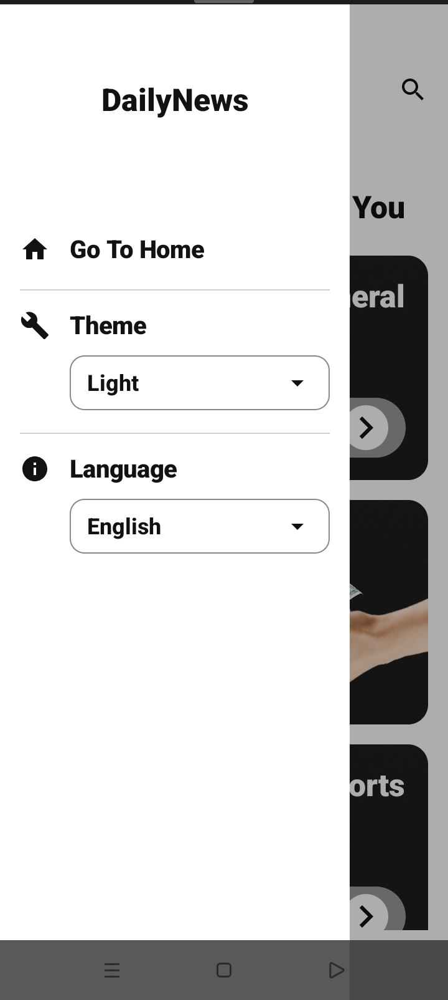
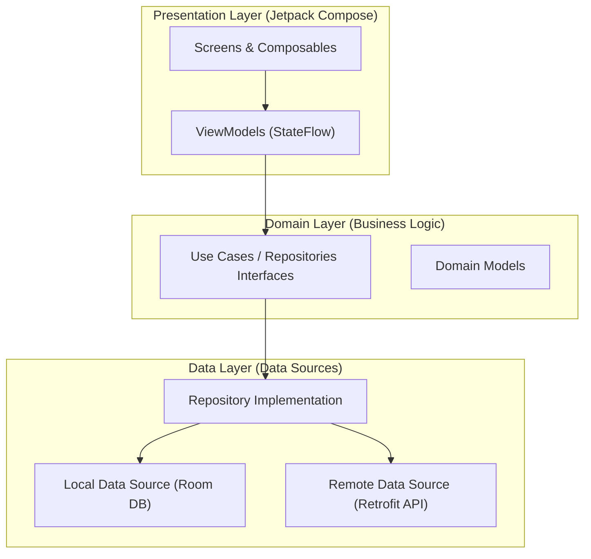

<div align="center">



# DailyNews

### Modern Android News App built with Jetpack Compose

DailyNews is a production-grade Android application engineered with Clean Architecture and MVVM patterns. It delivers real-time breaking world news across multiple categories with full offline caching, dynamic localization, and modern Material 3 styling.

[](https://developer.android.com)
[](https://kotlinlang.org)
[](https://developer.android.com/jetpack/compose)
[](https://developer.android.com/topic/architecture)
[](LICENSE)

</div>

---

## 📱 App Screenshots
<table align="center">
<tr>
<td align="center">
 width="280" alt="Home Screen"/><br/>
<strong>Home</strong>
</td>

<td align="center">
 width="280" alt="Search Screen"/><br/>
<strong>Search</strong>
</td>
</tr>

<tr>
<td align="center">
 width="280" alt="Article Details Screen"/><br/>
<strong>Article Details</strong>
</td>

<td align="center">
 width="280" alt="Settings Screen"/><br/>
<strong>Settings</strong>
</td>
</tr>
</table>

## ✨ Features

- 📰 Real-time news updates
- 🔍 Instant article search
- 📂 Category browsing
- 💾 Offline caching with Room
- 🌍 English & Arabic (RTL)
- 🎨 Material 3 UI
- ⚡ Kotlin Coroutines & Flow
- 📱 Clean Architecture (MVVM)

---

## 🏛️ Architecture

DailyNews follows Google's recommended **Clean Architecture** guidelines, separating code into distinct, testable layers:



- **UI Layer**: Composable screens observed from `ViewModel` `StateFlow` states.
- **Domain Layer**: Core business models and repository interfaces independent of Android framework code.
- **Data Layer**: Coordinates local cache (Room) and remote REST endpoints (Retrofit) with automatic failover.

---

## 🛠️ Tech Stack & Libraries

| Category | Library / Tool | Purpose |
|---|---|---|
| **UI** | Jetpack Compose & Material 3 | Declarative UI components and thematic styling |
| **DI** | Hilt (Dagger) | Dependency injection container |
| **Database** | Room | Local SQLite database persistence |
| **Networking** | Retrofit  & OkHttp 4 | REST API HTTP client and interceptors |
| **Async** | Kotlin Coroutines & Flow | Asynchronous streams and reactive state handling |
| **Images** | Glide Compose | Asynchronous image loading and disk caching |
| **Preferences**| Preferences DataStore | Lightweight key-value preferences |
| **Logging** | Timber | Production-guarded debug logging |

---

## 📂 Project Structure

```
DailyNews/
├── app/
│   └── src/
│       ├── main/
│       │   ├── java/com/mohamed/dailynews/
│       │   │   ├── data/
│       │   │   │   ├── api/             # Retrofit interfaces & WebServices
│       │   │   │   ├── database/        # Room Database & DAOs
│       │   │   │   ├── di/              # Hilt modules (Network, Database)
│       │   │   │   ├── mapper/          # DTO to Domain Mappers
│       │   │   │   └── repositories/    # Repository implementations
│       │   │   ├── domain/
│       │   │   │   ├── model/           # Business entities (Article, Source)
│       │   │   │   └── repository/      # Repository contracts
│       │   │   └── ui/
│       │   │       ├── screens/         # Home, Detail, Search, Settings
│       │   │       ├── theme/           # Color, Type, Theme tokens
│       │   │       └── utils/           # Navigation & Route definitions
│       │   └── res/                     # Vector drawables & localized strings
└── Brand/                               # Official design system & assets
```

---

## ⚙️ Installation & Setup

1. **Clone the repository**:
   ```bash
   git clone https://github.com/MohamedMosad0/DailyNews.git
   cd DailyNews
   ```

2. **Configure API Key**:
   Add your NewsAPI key to `local.properties` in the project root:
   ```properties
   NEWS_API_KEY=your_news_api_key_here
   ```

3. **Build & Run**:
   Open in Android Studio (Ladybug or newer) and run on an emulator or connected device running Android 7.0+ (API 24+).

---

## 🎨 Brand Identity

The app's brand identity system is defined in the [Brand Guidelines](Brand/Guidelines/Brand_Guidelines.md):

- **Primary Accent**: Crimson Red (`#E53935`)
- **Midnight Background**: Dark Canvas (`#121212`)
- **Typography**: Poppins
- **Assets Package**: SVG, PNG, PDF, and Figma source files under [Brand/](Brand/)

---

## 📄 License

This project is licensed under the MIT License.

See the LICENSE file for details.
