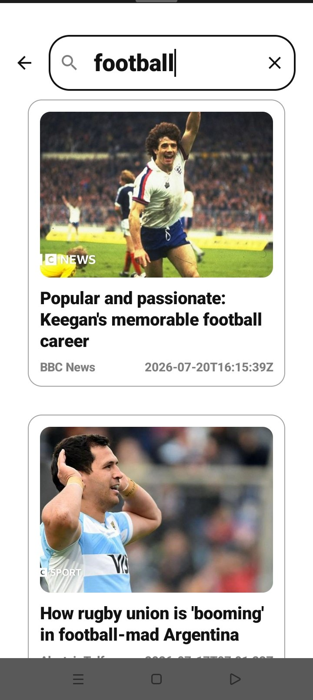

<div align="center">


# 📰 DailyNews

### Offline-First Android News Application

DailyNews is an Android news application built with Jetpack Compose and Clean Architecture. It lets users browse news by category and source, search for articles, and continue reading cached content when the network is unavailable.

[](https://developer.android.com)
[](https://kotlinlang.org)
[]()
[](.github/workflows/android-ci.yml)
[](LICENSE)

</div>

---

## Features

- Browse news by category and source
- Search articles online with offline search fallback
- Offline-first article and source caching with Room
- Transactional cache replacement after successful remote requests
- Reactive UI state with StateFlow and unidirectional data flow
- English and Arabic app language support
- Material 3 UI with dark mode
- Separate network DTOs, database entities, and domain models

## Screenshots

<div align="center">
  <table>
    <tr>
      <td align="center"><b>Home</b><br/><br/></td>
      <td align="center"><b>News Sources</b><br/><br/></td>
    </tr>
    <tr>
      <td align="center"><b>Search Articles</b><br/><br/></td>
      <td align="center"><b>Article Details</b><br/><br/></td>
    </tr>
  </table>
</div>

## Architecture

DailyNews follows **Clean Architecture** with **MVVM** and separates presentation, domain, and data responsibilities.

```text
Presentation (Compose + ViewModels)
            ↓
        Domain (Use Cases)
            ↓
       Repository Contract
            ↓
     Repository Implementation
        ↙             ↘
   Room / Local      Retrofit / API
```

The repository chooses remote data when available and falls back to cached Room data when a request fails or the device is offline. Network DTOs, database entities, and domain models are mapped separately.

## Tech Stack

- Kotlin
- Jetpack Compose + Material 3
- MVVM + Clean Architecture
- Hilt
- Retrofit + OkHttp
- Room
- DataStore
- Coroutines + Flow / StateFlow
- Navigation Compose
- GitHub Actions

## Testing

The project includes JVM unit tests covering:

- Repository online/offline and cache fallback behavior
- ViewModel UI state, search debounce, and request cancellation
- DTO → Entity → Domain mapping
- Use Case execution

Run tests:

```bash
./gradlew testDebugUnitTest
```

## CI/CD

GitHub Actions validates the project with Gradle build, unit tests, lint, and debug/release build tasks.

## Getting Started

Requirements:

- Android Studio
- JDK 17
- Android SDK

Configure the News API key in `local.properties`:

```properties
NEWS_API_KEY=your_actual_api_key_here
```

Build the debug APK:

```bash
./gradlew assembleDebug
```

Do not commit API keys or other secrets.

## License

This project is licensed under the MIT License.